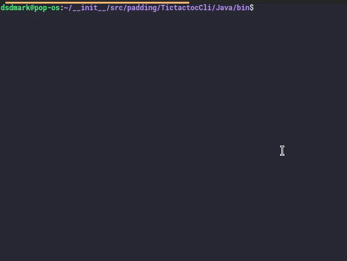

# Tictactoe

## Purpose

> It's a BASIC game based on ***java language***. If you're going to learn about **java**. then, this application will help you with how things work in **java**.

---

### How to install

1. Click on green **Clone or download** button and choose Download ZIP.
2. Find the downloaded zipped file on your pc and extract it.
3. Rum commend
> `java main.java` or `javac /bin/TicTacToe` and `java /bin/TicTacToe`

> **Note**:- Run that commend accoding to your `complier`.

Once you are done  you can close the application in your terminal to quit the application.

---

### Tictactoe

> If you have any issues with that Application feel free to let me know!

> If you are more interested, check out the collection of [ **CLIsapplications**](https://github.com/DSDmark/CLIsapplications"CLIsapplications").

---
